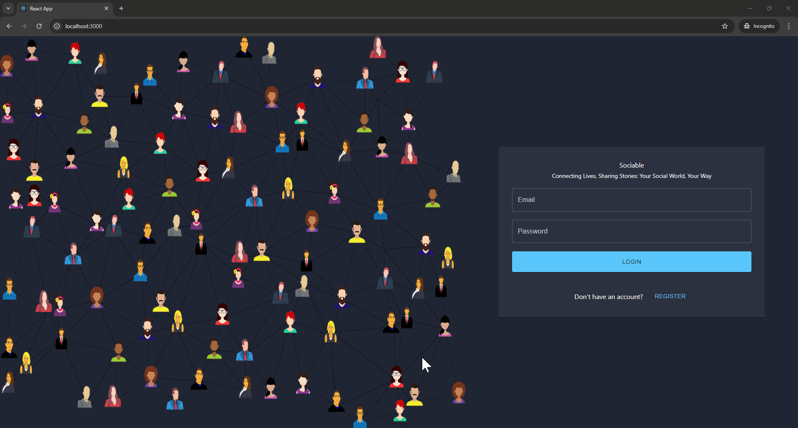
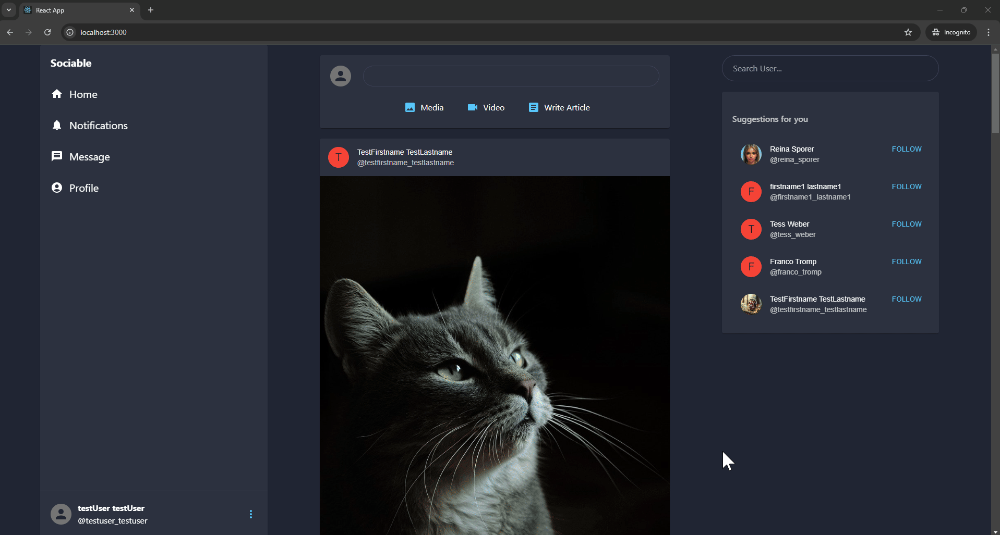
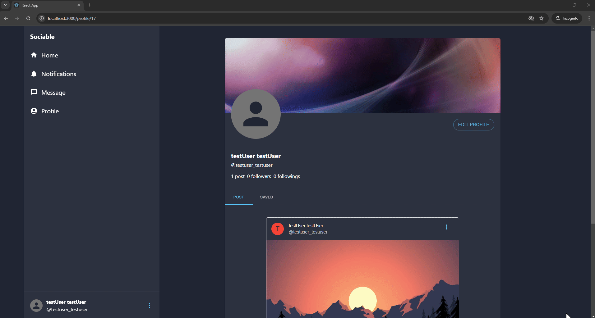
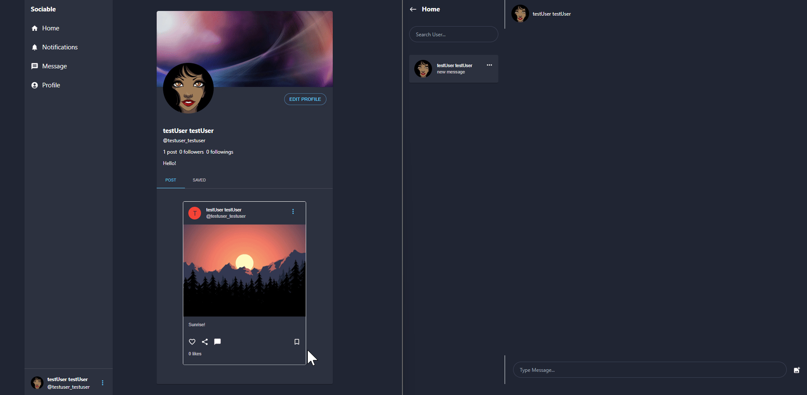

# Simple SNS Microservices

This project is for users to interact each other by posting their stories and photos & videos

## Features

- This project is consists of 8 different services
  - User Service
  - Post Service
  - Comment Service
  - Chat Service
  - Storage Service
  - Notification Service
  - Eureka Server
  - Gateway
- Users can create/login using their credentials
- Users can post their stories also make comments on other users posts
- Users get notified if other users like/make comments on their posts
- Users can follow each other
- Users can message each other

## Tech Stack

## Microservices Diagram
  

## Demo
- User Signup
  

- Post
  

- Profile
  

- Notification
  

- Chat
  

## Lessons Learned

- Polling
    - Client sends scheduled request and server sends response
    - Unnecessary API calls can happen if there's no updated data
    - Cannot receive response as a real-time update
- Long-Polling
    - Client sends request and server sends response if there is updated data as a real-time update
    - Improved from Polling, However, if data is updated very often, there is not so much difference from Polling
- SSE (Server-Sent Event)
    - Client can subscribe a specific event
    - If event occurs in the server, the server sends a response to the client
    - This is uni-directional, server to client
- WebSocket
    - Enables bidirectional communication between the server and the client
